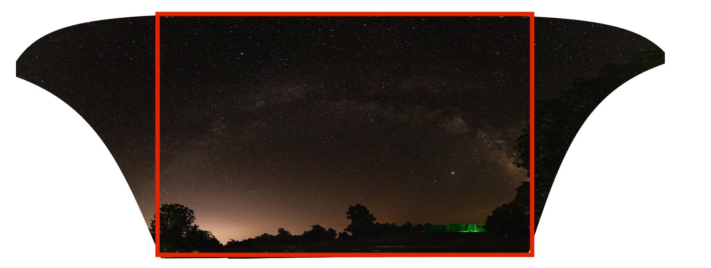

# Difference between Fill Edges and Auto Crop in Lightroom Classic 9.x Photo Merging

Occasionally, on nights that I notice the sky is particularly clear, I'll set up my Canon EOS 80D on a tripod to take some sky pictures before bed in the hopes of a Lightroom panorama merge (Photo -> Photo Merge -> Panorama) working well the next morning.

More often than not, panorama photos will merge fine and I'll have a decent sky panorama (need to work on the picture settings though for less noise).

*Spherical Photo Merge with some of the Milky Way visible*

*Spherical Photo Merge with some obvious border warping near the top*

*(Non night sky) Cylindrical Photo Merge*

I'll typically choose the Spherical Photo Merge mode for night time pictures as I aim the camera upwards more resulting in each image contributing a pizza wedge shape of unique photo space to the total panorama.
For day time landscape photos, I usually end up doing a Cylindrical Photo Merge as the camera is aimed more at the horizon resulting in each image contributing a more rectangular piece of unique photo space to the composite panorama.

See Adobe's [panorama docs](https://helpx.adobe.com/lightroom-classic/help/panorama.html) for more info on the different merging modes.

It wasn't until recently that I noticed the new "Fill Edges" option in the Photo Merge editor window. I'll typically use "Auto Crop" and warp the edges to increase the usable boundaries until the warping becomes too noticeable.

I tried out Fill Edges on a night sky panorama last night to discover that the option does the opposite of Auto Crop. Rather than cutting the irregular edges of the merged photo down to a rectangle, it fills them out into a rectangle that can contain the entire irregularly shaped panorama.

*Auto Crop option will cut image down to the largest rectangle that can be contained inside the panorama*

It appears that Lightroom accomplishes the filling by cloning the edges it's filling next to and will be more or less successful depending on how much information is available at the borders and how much white space there is to be filled.

*Fill Edges option will fill in white space up to the smallest rectangle that can fully contain the panorama*

Fill Edges works well with the boundary warp option as the more you warp the boundary to straighten the panorama, the less white space needs to be filled and the more natural the fill will appear.

Using this set of 8 portrait oriented images taken horizontally in a row from left to right, I merged panoramas using both options separately and adjusting the Boundary Warp from 0 to 100 to better compare the results of using both. The table below is resized a little, [see here](https://raw.githubusercontent.com/arenglish/tutorials/master/lightroom-auto-crop-vs-fill-edges/assets/2020-07-13_22-50-56160_Canon_EOS_80D-Pano_comparison.jpg) for the full size image (~5MB).

*Comparison of Auto Crop and Fill Edges with varying boundary warp*

Notice that with 100% boundary warping there's nothing for either Auto Crop or Fill Edges to do, so the result is the same for both. It's difficult to notice this on the downsized table view, but in the full size image, you can see that with 0% Boundary warping on Fill Edges, Lightroom had trouble in the bottom right and left corners of the image where there was significantly more white space to fill in than anywhere else.

*Fill Edges cloning is obvious in bottom corners when no Boundary Warp is used*

The cloning is noticeable and in the bottom right, it looks like a section of starry sky was cloned into the trees.

However, at 25% Boundary Warping on the Fill Edges option, the unacceptable marks of cloning are gone, and cloned portions blend in better with the surroundings.

*Fill Edges with 25% Boundary Warping is not nearly as bad*

From 25% Boundary Warping onward, the Fill Edges method gets cleaner with the tradeoff being that you are seemingly losing some panorama space as the fake cloned fill becomes less necessary as the Boundary Warp increases.

Auto Cropping on the other hand starts out the cleanest of both methods and becomes relatively more distorted yet more spacious as Boundary Warping increases.

*Auto Crop with no Boundary Warping. It doesn't seem to contain nearly as much panorama as the previous Fill Edges.*

*Comparing panorama cleanness for Fill Edges and Auto Crop*

*Comparing preserved content of panorama for Auto Crop and Fill Edges*

My takeaway from comparing the two panorama normalization methods provided by Lightroom is that both options produce acceptable results if you combine them with some boundary warping.

Fill Edges can fake a larger panorama that is more likely to contain the subject you were capturing with sufficient space around it, but will suffer from obvious clone marks in areas where there's too much white space to fill in. For images where the border is a plain pattern like trees or sky, this isn't a big deal. If it were a crowd of people on the border, that might look ugly after cloning. Try Fill Edges first since it can produce a larger panorama, but fall back to Auto Crop if the border filling just isn't looking right.

Auto Crop will start you out with the least amount of content you thought you'd get out of your images, but will be the cleanest and will approach closer to 100% of your content as you give it more warping.

Also, more images will usually help, if I had padded this panorama with 1 to 2 extra portrait images on each side, the Auto Crop with some boundary warping would look just about as spacious as the Fill Edges.
